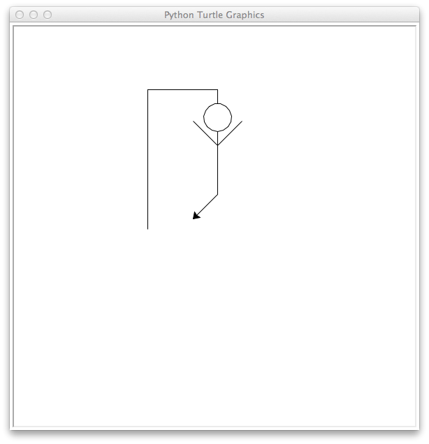

# Hangman Exercise

## Introduction

In this exercise you will practice

- writing Python programs and modules,
- writing programs and modules that use other modules,
- using control structures,
- validating user input and dealing with invalid input,
- using data structures and string processing, and
- writing interactive console programs.

## Problem Description

You like word-guessing games.

## Solution Description

Write a Python program in a file named `hangman.py` that implements the classic Hangman game.  Game play proceeds as follows:

- The hangman program asks the user what kind of word they want to guess, e.g., "hard", "easy".
- The hangman program chooses a word at random from the approprite list and displays the number of letters in the word in the form of a number of underlines (spaces to be filled in).
- As long as the hangman is not complete or the user has not guessed all the letters in the word:

    - The program asks the user to guess a letter.
    - The user enters a letter and presses return.
    - If the user enters more than one letter or a non-letter, tell the user to enter only one letter and try again.
    - If the user's guess is in the word, the letter is placed in the appropriate blanks (can be more than one occurrence in the word); otherwise a new body part is drawn on the hangman.
    - If, after the user's guess, the word is completely revealed, the user wins and the game is over.  Report this to the user and exit.
    - If, after the user's guess, the hangman is complete (head, body, arms, legs, etc.), the user loses and the game is over.  Report this to the user and exit.

Your program should use two provided modules, `drawing` and `words`, both located in the `hanglib` package.  Instructions for downloading these files:

- Create a `hangman` subdirectory of your coursework directory. This directory will contain your `hangman.py` file.
- Create a `hanglib` subdirectory of your `hangman` directory
- Download [draw.py](../code/hanglib/draw.py) and [words.py](../code/hanglib/words.py) into your `hanglib` directory

A finished hangman program will look something like this:

<table>
<tr>
<td>

</td>
<td>

</td>
</tr>
</table>

## Tips

- Remember that functions are first-class objects.  So you could have a list of functions, e.g., `parts = [draw.head, draw.body]` and call `draw.head` with `parts[0]()`.
- The `range()` function returns an interator over a range of integers.  For example, if you have a list of elements, `xs`, `range(len(xs))` returns an iterator over the indexes of `xs`. See [built-in functions docs](https://docs.python.org/3/library/functions.html).
- Python's standard `random` module's `choice(seq)` function returns a randomly chosen element from `seq`.  See [random module docs](https://docs.python.org/3/library/random.html).
- At the end of the game, ask the user to press a key to dismiss the hangman with the `input()` function.  Otherwise the turtle window with the hangman will disappear immediately.

## That Little Extra ...

Extend your hangman program by writing thee additional Python files (in your `hangman` directory) and integrating their content into your hangman program:

- `extraparts.py` -- a module that draws additional body parts on the hangman drawn by [draw.py](../code/hanglib/draw.py).  These can be facial features, hands, feet, or any creative non-lewd idea of your own.
- `extrawords.py` -- a module containing additional word lists, named by type of word.  Again, use your creativity.
-  -- a program that implements the hangman game using the provided modules and the two you create yourself.
