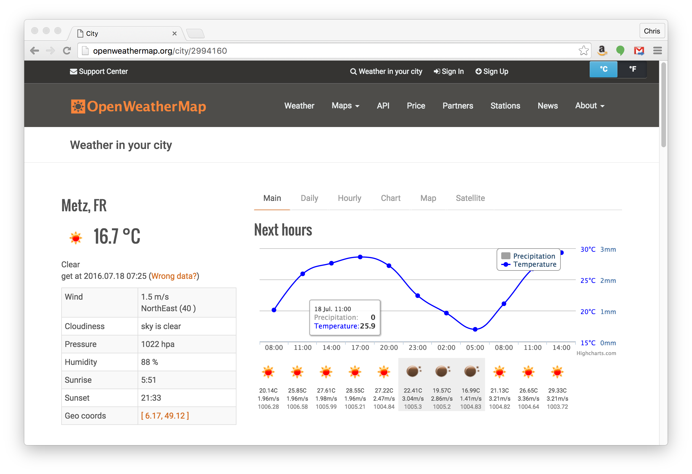
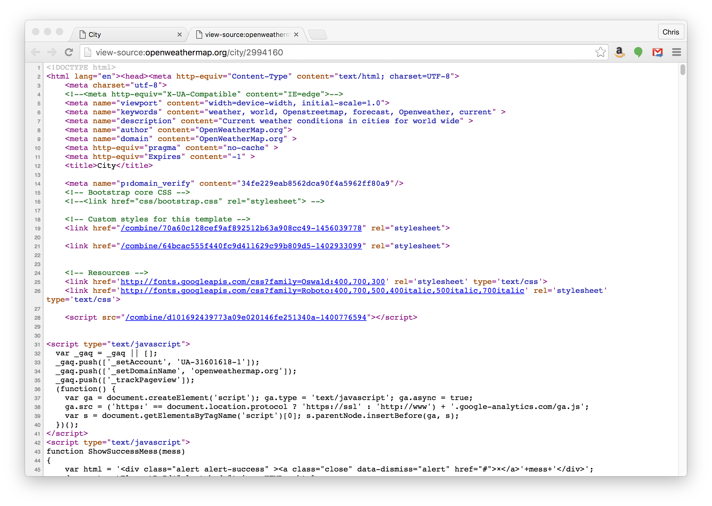
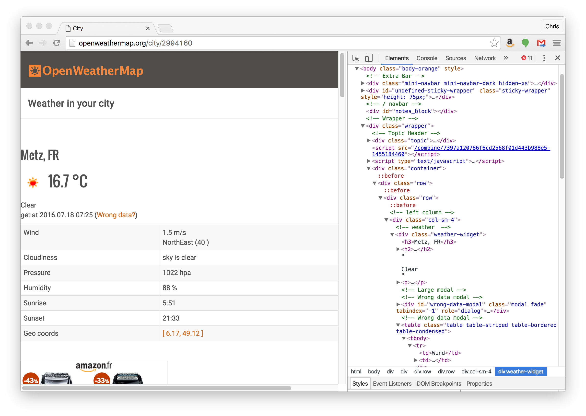

% Web Mining
% CS 2316

# Web Mining

Two ways to mine data from the web

- The hard way, by web scraping
- The easy way, using web service APIs

We’ll see examples of both.

# Web Scraping

Web scraping, a.k.a. screen scraping, means getting data from a web page. Suppose we want to get the current wind data for a city from [Open Weather Map](http://openweathermap.org/).



# What is a Web Page?

A web page is a chunk of text containing HTML code. The browser "renders" the HTML graphically. So web scraping means analyzing text using Python's text processing features.




# Finding The Data On the Page

First you need to find the data within the HTML code for a page so you can construct a regex. Your browser's developer features can help you find the data:




# Getting the Web Page's HTML Code

To get the HTML code of the web page into a Python string variable that you can play with, use Python's `urllib.request` module.

```python
import urllib.request
# 2994160 is the city code for Metz, FR
request = urllib.request.Request("http://www.openweathermap.com/city/2994160")
response = urllib.request.urlopen(request)
page_bytes = response.read()
page_text = page_bytes.decode()
# page_text is Python str containing the HTML code
```

# Extracting the Data

Looks like the wind data is in the second `<td>` element after the `
<div class="weather-widget">` tag, following a `<td>Wind</td>` element. We can play around with the HTML text in the Python REPL. We eventually end up with:

```python
wind = re.findall(r'<td>Wind</td><td>(.+?)</td>', page_text.replace("\n",""))[0]
```

Notice that we used a capture group to get the element data.

# Aside: Parsing HTML

HTML is context free language, which roughly means that it supports arbitrary nesting of elements. For example, you could have arbitrarily nested `div` elements with "leaf" elements containing text data, e.g.:

```html
<div>
    <div>
        <div>some text</div>
    </div>
</div>
```

By the rules of HTML, you could nest `div` tags as deeply as you want.

Regular expressions match regular laguages, which don't support arbitrary nesting. So how can we use regexes to "parse" HTML?

# Regex Matching in HTML Code

Parsing means scanning the linear sequence of symbols in a string to determine its structure (usually by putting the symbols in a tree).

We don't need to parse HTML to find data on a web page. While the HTML *language* supports arbitrary nesting, a particular web page will be nested to a particular depth, resulting a simple linear sequence of symbols that we can patch with a regular expression.