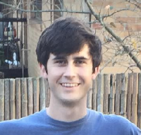
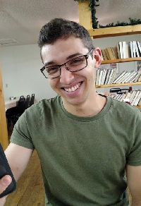
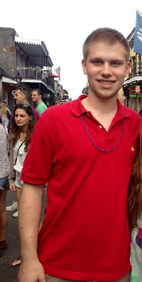
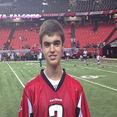

# Meet the TAs

### TA Recitation Sections:

TBD

## Head TA: Daniel Paré

**Major**: Industrial Engineering
**Year**: 4th
**Hometown**: Dalton, GA
**Fun Fact**: "I'm a Boston sports fan because half of my family is from there and the other half is from Canada."
pare421@gmail.com

## Brandon Best

**Major**: Industrial Engineering
**Year**: 3rd
**Hometown**: Canton, GA
**Hobbies**: "Food. Anything to do with food. Cooking, Eating, Experimenting, Food Network, Cooking Channel, etc.
I also like mud. I have a beautiful '93 Jeep Wrangler YJ with a 4 inch body lift and 2 inch suspension lift. And a 29' Mountain Bike, so dirt and I get along."
brandonbest13@gmail.com

## Megi Guliashvili

**Major**: Computer Science
**Year**: 4th
**Hometown**: Tbilisi, Georgia
**Fun Fact**: "I'm from Georgia (the country)..."
mguliashvili3@gatech.edu

## Alex Ketchum

**Major**: Industrial Engineering
**Year**: 4th
**Hometown**: Fairhope, Alabama
**Hobbies**: "I enjoy rock climbing, playing soccer, and watching football.  Outside of school I mentor for Big Brothers Big Sisters of Atlanta."
alexketchum@gatech.edu

## Katie Lau

**Major**: Industrial Engineering
**Year**: 3rd
**Hometown**: Snellville, GA
**Hobbies**: "I like to read and dance."
katiel@gatech.edu

## Zeba Munshi

**Major**: Industrial Engineering
**Year**: 4th
**Hometown**: Atlanta, GA
**Hobbies**: "Hobbies include making people laugh and eating donuts."
zsmunshi@gatech.edu

## Michael Tarbell

**Major**: Industrial Engineering
**Year**: 4th
**Hometown**: Marietta, GA
**Hobbies**: "Playing tennis, sports fan."
mtarbell3@gatech.edu

## Smita Tejo

**Major**: Industrial Engineering
**Year**: 3rd
**Hometown**: Plainsboro, NJ
**Hobbies**: "I like making bad playlists on Spotify."
smitatejo@gatech.edu
